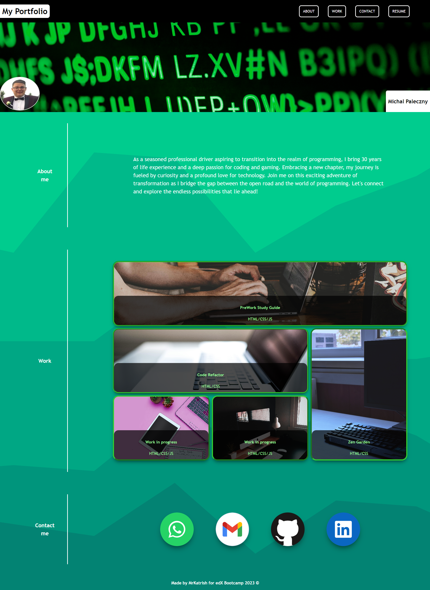

# Module 2 Challenge

## Description

Welcome to my portfolio! This project was developed as part of a bootcamp assignment to create a professional portfolio that caters to the needs of hiring front-end developers. My motivation for creating this portfolio was driven by the desire to establish a strong online presence and showcase my skills and projects to potential employers. Throughout the development of this project, I gained valuable experience in creating a responsive and visually appealing web design. I enhanced my understanding of HTML andCSS to implement smooth navigation, responsive layouts, and interactive features.

## Table of Contents

  - [Description](#description)
  - [Installation](#installation)
  - [Usage](#usage)
  - [Features](#features)
  - [Screenshots](#screenshots)
  - [Credits](#credits)
  - [License](#license)
  - [Technologies Used](#technologies-used)

## Installation

To run this project locally, follow these steps:

1. Clone the repository to your local machine. In bash type:

&nbsp;&nbsp;&nbsp;&nbsp;&nbsp;&nbsp;`git clone https://github.com/MrKatrish/second_week_homework`

2. Open the index.html file in your preferred web browser.

3. Explore the different sections and functionalities of the portfolio.

## Usage

Feel free to explore my portfolio to learn more about me and my work. Click on the navigation links to jump to specific sections.

## Features

1. **Introduction:**
 - Upon loading the page, you will be greeted with my name and a recent photo or avatar.
 - The navigation menu includes links to sections about me, my work, and how to contact me.
2. **Navigation:**
 - Clicking on any navigation link smoothly scrolls the UI to the corresponding section on the page.
3. **Work Section:**
 - The "Work" section features titled images of my applications.
 - The image of the first application is larger in size compared to the others.
4. **Application Details:**
 - Clicking on the images of the applications takes you to the deployed version of that specific application.
5. **Responsive Design:**
 - The layout adapts responsively to different screen sizes and devices, ensuring a seamless viewing experience.

## Screenshots

## Credits

Thanks for help to my collagues for explaining and directing me to the right path. Many thanks to edX instructor and TAs for taking great care of me.

Box images: https://www.pexels.com/search/computer/

Background: https://app.haikei.app/

Icons for footer: https://iconduck.com/

## License

This project is licensed under the MIT License.

## Technologies Used

- HTML5
- CSS3
